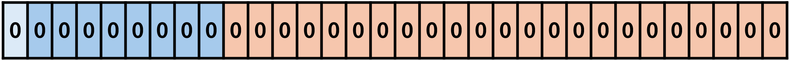
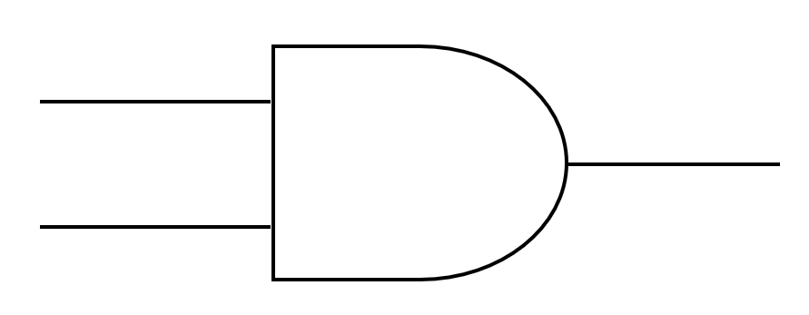
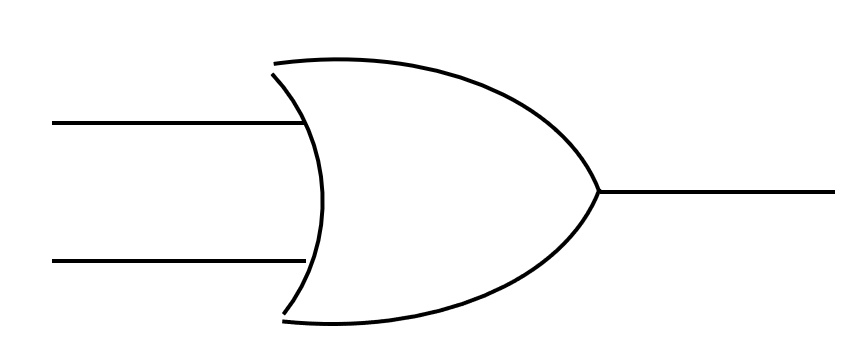
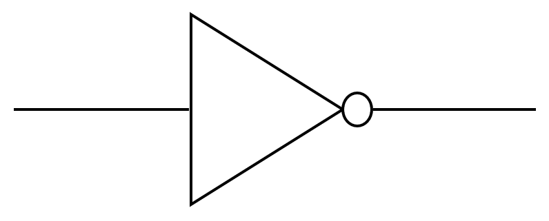
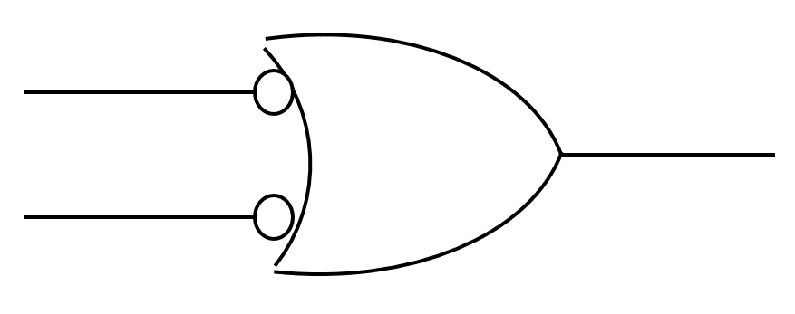
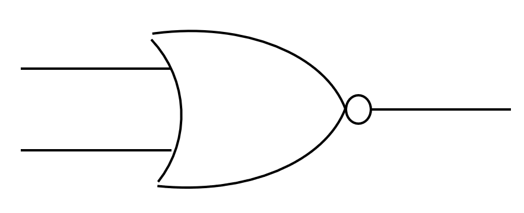
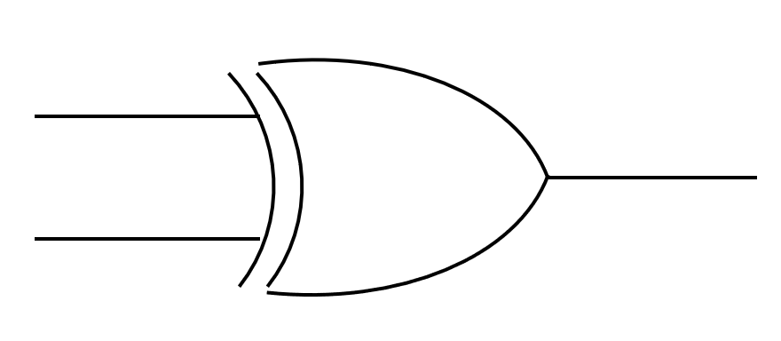

# 情報I 1学期期末考査 対策プリント

# 10進数・2進数・16進数 変換表
- 10進数・2進数・16進数の問題が出たときはこの表を書きましょう

| 10進数 | 2進数 | 16進数 |
|----|------|---|
| 0  | 0000 | 0 |
| 1  | 0001 | 1 |
| 2  | 0010 | 2 |
| 3  | 0011 | 3 |
| 4  | 0100 | 4 |
| 5  | 0101 | 5 |
| 6  | 0110 | 6 |
| 7  | 0111 | 7 |
| 8  | 1000 | 8 |
| 9  | 1001 | 9 |
| 10 | 1010 | A |
| 11 | 1011 | B |
| 12 | 1100 | C |
| 13 | 1101 | D |
| 14 | 1110 | E |
| 15 | 1111 | F |

---
---

# プリント (補数)
- コンピューターで負の数を表現する場合、**補数**を利用する
    - 定義
        - 足すと1桁増える最も小さな数
    - n進法の補数をnの補数と呼ぶ    
    - 計算方法 (2進数の場合)
        1. `0`と`1`を反転させる
        2. 反転したものに1を足す
    - 計算例 `3₁₀`の2進数3ビット
        - `3₁₀` = `011₂`
        - `011`の`0`と`1`を入れ替えて`100`にする
        - `100` + `1` = `101`
- 数値をコンピューターのビットで表す時、あらかじめ決められたビットの長さをビット長という
    - その際、正負を表すために最上位の桁を符号ビットとし、`0`で正、`1`で負を表す
    - 計算の際、ビット長を超えた場合、超えた部分は消滅する
- 補数を用いたnビットの2進数で表現できる整数の範囲は `-2ⁿ⁻¹ ~ 2ⁿ⁻¹ - 1`である

---
# プリント (実数)
- 10進数と2進数の変換 (小数)
    - 計算方法
        1. 小数部分に2を掛けて繰り上がった整数を順に取り出していく
        2. 小数部分が0になるまで繰り返す
        3. 取り出した整数(0と1)が2進数の小数部分になる
    - 例 (`0.625₁₀`)
        1. 2を掛けて整数部分を順に取り出していく
            - `0.625` × `2` = `1.25`　→ 整数部分 `1`
            - `0.25` × `2` = `0.5`　 → 整数部分 `0`
            - `0.5` × `2` = `1.`　 → 整数部分 `1`
        2. ここで小数部分が`0`になったので終了
        3. 答えは`0.101₂`
- 実数の表現
    - **固定小数点数**
        - 小数点の位置を固定
    -  **浮動小数点数**
        - 小数点の位置が移動
        - コンピューターではこちらを使う
        - **IEEE754**という規格が定められている
    - 浮動小数点数の計算 (IEEE754)
        - **符号部** S : 符号(+, -)を表す
        - **指数部** E : 小数点の位置を表す
        - **仮数部** M : 実際の数字を表す 
        - **(-1)s × 1.M × 2E-127**
        - 実際の計算
            1. 与えられた10進数を2進数に変換
            2. 上の浮動小数点数の式の形に変形 (この作業を**正規化**と呼ぶ)
                - この時、指数部はE-127の形にすることに注意
            3. Eを2進数に変換
            4. S(1桁)、E(8桁)、M(23桁)を順に下の表に書く
                - Mは左詰めにし、余ったところは0を書く

---
# プリント (論理回路)
- コンピューターは0と1の2種類の信号で処理をする
- その演算や制御をする回路を**論理回路**という
    - **論理積(AND)回路**
    - **論理積(OR)回路**
    - **否定(NOT)回路**
    で全ての回路を表現できる
- 論理回路の入力と出力の関係表を**真理値表**という

### AND（論理積）
- 両方が1のときだけ1を出力

| A | B | A AND B |
|---|---|----------|
| 0 | 0 |    0     |
| 0 | 1 |    0     |
| 1 | 0 |    0     |
| 1 | 1 |    1     |

### OR（論理和）
- 片方でも1なら1を出力

| A | B | A OR B |
|---|---|---------|
| 0 | 0 |   0     |
| 0 | 1 |   1     |
| 1 | 0 |   1     |
| 1 | 1 |   1     |

### NOT（否定）
- 入力を反転（0→1、1→0）

| A | NOT A |
|---|--------|
| 0 |   1    |
| 1 |   0    |

### NAND（否定論理積）
- ANDの否定（両方1以外なら1）

| A | B | A NAND B |
|---|---|-----------|
| 0 | 0 |     1     |
| 0 | 1 |     1     |
| 1 | 0 |     1     |
| 1 | 1 |     0     |

### NOR（否定論理和）
- ORの否定（どちらも0のときだけ1）

| A | B | A NOR B |
|---|---|----------|
| 0 | 0 |    1     |
| 0 | 1 |    0     |
| 1 | 0 |    0     |
| 1 | 1 |    0     |

### XOR（排他的論理和）
- 異なるときだけ1を出力

| A | B | A XOR B |
|---|---|----------|
| 0 | 0 |    0     |
| 0 | 1 |    1     |
| 1 | 0 |    1     |
| 1 | 1 |    0     |

### 半加算器・Half Adder (HA)
- 2進数1桁の加算回路
- 単純にAとBを足すだけ
- Sが結果、Cは繰り上がり

| **入力**   |     | **出力** |      |
|-------|-------|---------|-------|
| **A** | **B** | **C** | **S** |
| 0 | 0 |  0  |   0   |
| 0 | 1 |  0  |   1   |
| 1 | 0 |  0  |   1   |
| 1 | 1 |  1  |   0   |

### 全加算器・Full Adder (FA)
- 多くの桁の加算をするために、桁上げを考慮した回路
- AとBとXを足すだけ
- Sが結果、Cは繰り上がり

| **入力** |      |     | **出力** |          |
|------------|------| ---|------------|----------|
| **A** | **B** | **X** | **C** | **S** |
| 0 | 0  | 0  |  0  |  0   |
| 0 | 1  | 0  |  0  |  1   |
| 1 | 0  | 0  |  0  |  1   |
| 1 | 1  | 0  |  1  |  0   |
| 0 | 0  | 1  |  0  |  1   |
| 0 | 1  | 1  |  1  |  0   |
| 1 | 0  | 1  |  1  |  0   |
| 1 | 1  | 1  |  1  |  1   |

---
# 10. デジタル情報の特徴
## Point
- **アナログ**
    - 連続的・細かな表現、再現性なし
- **デジタル**
    - 離散的・復元・再現可能な表現、細かな表現ができない
- コンピューターのデジタル表現
    - すべての情報を0と1で表現
    - **2進法**
        - 0と1の組み合わせで数を表現
    - **2進数**
        - 2進法で表した数値

## ノート補足
- **アナログ**
    - *ノイズ*が加わると完全除去ができない
- **デジタル**
    - アナログ波形をはっきりした変化に置き換えている
    - ノイズが加わっても完全除去できる
    - 情報の品質を維持しやすい
        - CD(デジタル媒体)はコピーを繰り返してもノイズが入らない
    - 数値化されるため、**修正・編集などの加工が容易**
    - **圧縮**や、セキュリティ向上のための**暗号化**ができる

- 2進法・2進数
    - 0と1で表す
    - コンピューターでは電圧の高低で0と1を表している
    - CDではピット・ランド(高低差)を使い、高さが変わるところを1、変わらないところを0としている

- 情報量とその単位
    - **ビット**
        - 最小単位
        - 2進数の1桁に相当
        - 2通りの情報を表現
    - **バイト**
        - **8ビット = 1バイト**
        - 単位はB(Byteの頭文字)
        - 例えば3Bの時、3バイト -> 24ビットとなるので、2²⁴通りの情報を表現できる
    - 接頭辞
        - 1024B (2¹⁰B) -> 1KB
        - 1024KB (2²⁰B) -> 1MB
---
# 11. 数値と文字の表現
## Point
- **16進数**
    - *0～9に加えてA～Fの16種類*の文字で表す
    - 2進数4桁を16進数1桁で表せる
- **補数**
    - 整数nに整数mを足した時、桁が繰り上がる値の中で最も小さいm
    - 引き算を足し算だけで計算するための表し方
- **浮動小数点数**
    - 小数点の位置を動かし、コンピューター上で実数を効率よく表現するための方法
    - 一般的にIEEE754という標準規格で定められた方法で表現する
- **文字コード**
    - 2進数で文字を表すための規則
    - JIS、UTF-8、EUC-JPなどの種類がある
    - JISコードでは*英数字は1バイト*、*漢字等は2バイト*で1文字を表す
    - 別の種類の文字コードで文字を読み込むと文字化けする

---
# 13. 音の表現
## Point
- **音**
    - **周波数** (単位:Hz)
        - 1秒間に含まれる波の数
    - **周期** (単位:秒)
        - 1個の波が伝わる時間
- **標本化** (**サンプリング**)
        - 音波を決まった間隔(標本化周期;単位:秒)で区切り、音の振れの値を取り出す処理
    - **標本化周波数** (単位:Hz)
        - 標本化周期の逆数
        - 1秒間に標本化する回数
- **量子化**
    - アナログ音声信号をデジタルに変換する処理
    - 波の振幅を決まった段階数で表現
- **量子化ビット数**
    - 量子化の段階数を決める数値
    - 一般にnビットで2ⁿ段階
- **符号化**
    - 量子化した値を2進数で表現する処理
- **PCM方式**
    - パルス符号変調(Pulse Code Modulation)の略
    - 標本化・量子化・符号化の一連の処理のこと

## ノート補足
- 音のデジタル化手順 (PCM方式)
    - **標本化**(**サンプリング**) (*区切る*) -> **量子化**(*数値化*) -> **符号化** (*2進数*)
- 音質の比較 (ノート4⃣のまとめ)
    - 標本化周波数44100Hzで標本化するCDは1秒間に44100回標本化される
    - 標本化周期は標本化周波数の逆数なので、1÷44100=0.000023秒となる
    - 量子化ビット数は16ビットなので、段階の数は2¹⁶段階となる
    - 標本化周波数が大きいほど音質が良い

---
# 14. 画像の表現
## Point
- **光の三原色**
    - テレビ・ディスプレイなどで利用されている色の表現方法
    - **赤(Red、R)、緑(Green、G)、青(Blue、B)**の3つ
        - **RGB**とも言う
    - **加法混色**
- **画素**(ピクセル)
    - コンピューターで画像を表現するときの最小単位
    - *R、G、Bの3つをまとめて1つ*とする
- **解像度**
    - 画素の細かさ
- **階調**
    - *光の明るさの段階数*
    - **24ビットフルカラー**
        - R、G、Bそれぞれを8ビット、1画素に24ビットを割り当てる
        - 8ビットなので2⁸=**256**階調である
        - **16777216色**を表現できる
- アナログ画像を一定の間隔で分割し、赤、青、緑の成分ごとに各画素の明るさ(濃淡)を取り出してデジタル化
- **ラスタ形式・ラスタグラフィックス**
    - ラスタ系ソフトウェアでの画像の形式
    - *画素の集まりで表す画像*
    - 拡大するとギザギザ(**ジャギー**)が見える
- **ベクタ形式・ベクタグラフィックス**
    - ベクタ系ソフトウェアでの画像の形式
    - *基準点からの座標・角度・太さなどで表す*画像

## ノート補足
- **色の三原色**
    - *印刷機やプリンター*で使われる
    - **シアン**、**マゼンタ**、**イエロー**のインクを混ぜる
    - 混ぜると黒に近づくが完全な黒にはならないので黒インクも使う
    - **減色混色**
- ファイルサイズの計算
    - 計算方法
        1. 縦 × 横 = 画素数
        2. 8nビット→nバイト
        3. 画素数 × n = ファイルサイズ
    - 保存できる枚数
        1. 記録用メモリの容量 ÷ ファイルサイズ = 保存できる枚数

---
# Excelの使い方
- 四角のマスのことを**セル**と呼ぶ
- 列(上部)のアルファベットと行(左端)の数字を使ってセルの場所(**セル番地**)を表す
    - 例: A1, B5, S30
- `=`を使って計算を始める
- `=セル番地1+セル番地2-セル番地3...`で四則演算
    - `+`が足し算、`-`が引き算、`*`が掛け算、`/`が割り算
- `=関数名(セル番地1:セル番地2)`でセル番地1~2の間の全てのセルの数値を対象として各関数の計算が行われる
    - 関数の種類
        - `SUM`
            - 範囲内の数値を合計
        - `AVERAGE`
            - 範囲内の数値の平均を計算
        - `MAX`/`MIN`
            - 範囲内の数値の最大値/最小値を表示