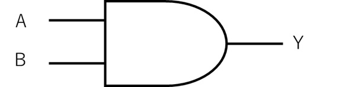
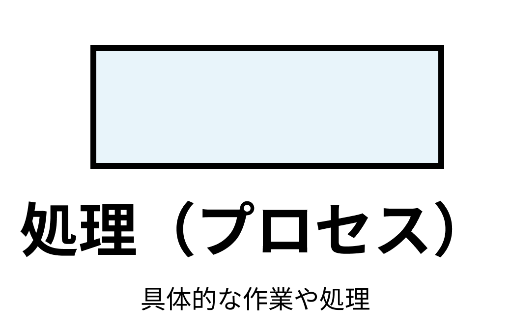
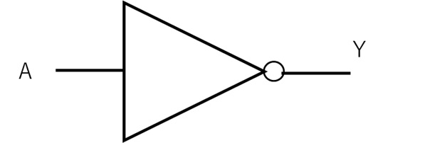
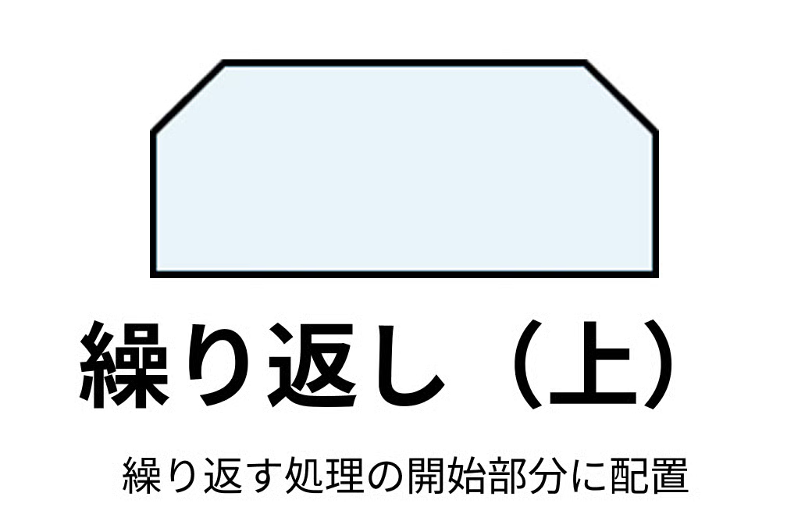
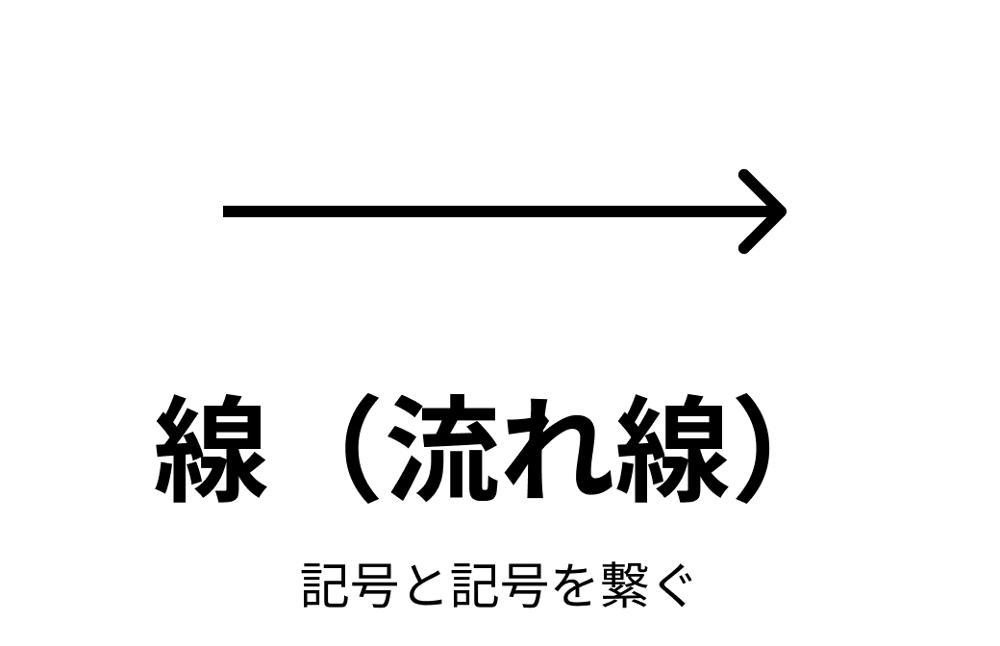

# 情報I 1学期期末考査 対策プリント
- 以下のテキストはCC-BY-SA 4.0の下で提供されます
- 

## 留意事項
- これは学校公式のものではありません
- 基本はプリントとノートのまとめですが、考査に出なかった時の責任は負いません

## 更新履歴
- 2025/06/22 23:30 初版公開 プリント3枚と14章は未作成
- 2025/06/24 23:24 プリントの内容を書いたが未完 図を載せるのが難しい

# 10進数・2進数・16進数 変換表
- 10進数・2進数・16進数の問題が出たときはこの表を書きましょう

| 10進数 | 2進数 | 16進数 |
|----|------|---|
| 0  | 0000 | 0 |
| 1  | 0001 | 1 |
| 2  | 0010 | 2 |
| 3  | 0011 | 3 |
| 4  | 0100 | 4 |
| 5  | 0101 | 5 |
| 6  | 0110 | 6 |
| 7  | 0111 | 7 |
| 8  | 1000 | 8 |
| 9  | 1001 | 9 |
| 10 | 1010 | A |
| 11 | 1011 | B |
| 12 | 1100 | C |
| 13 | 1101 | D |
| 14 | 1110 | E |
| 15 | 1111 | F |

# プリント (補数)
※n進数の変換は省略します
- コンピューターで負の数を表現する場合、補数を利用する
    - 定義
        - 足すと1桁増える最も小さな数
    - n進法の補数をnの補数と呼ぶ    
    - 計算方法 (2進数の場合)
        1. 0と1を反転させる
        2. 反転したものに1を足す
    - 計算例 3₁₀の2進数3ビット
        - 3₁₀ = 011₂
        - 011の0と1を入れ替えて100にする
        - 100 + 1 = 101
- 数値をコンピューターのビットで表す時、あらかじめ決められたビットの長さをビット長という
    - その際、正負を表すために最上位の桁を符号ビットとし、0で正、1で負を表す
    - 計算の際、ビット長を超えた場合、超えた部分は消滅する
- 補数を用いたnビットの2進数で表現できる整数の範囲は `-2ⁿ⁻¹ ~ 2ⁿ⁻¹ - 1`である

# プリント (実数)
- 10進数と2進数の変換 (小数)
    - 計算方法
        1. 小数部分に2を掛けて繰り上がった整数を順に取り出していく
        2. 小数部分が0になるまで繰り返す
        3. 取り出した整数(0と1)が2進数の小数部分になる
    - 例 (0.625₁₀)
        1. 2を掛けて整数部分を順に取り出していく
            - 0.625 × 2 = 1.25　→ 整数部分 1
            - 0.25 × 2 = 0.5　 → 整数部分 0
            - 0.5 × 2 = 1.0　 → 整数部分 1
        2. ここで小数部分が0になったので終了
        3. 答えは0.101₂
- 実数の表現
    - 固定小数点数
        - 小数点の位置を固定
    -  浮動小数点数
        - 小数点の位置が移動
        - コンピューターではこちらを使う
        - IEEE754という規格が定められている
    - 浮動小数点数の計算 (IEEE754)
        - 符号部 S : 符号(+, -)を表す
        - 指数部 E : 小数点の位置を表す
        - 仮数部 M : 実際の数字を表す 
    - 計算例9

# プリント (論理回路)
- コンピューターは0と1の2種類の信号で処理をする
- その演算や制御をする回路を論理回路という
    - 論理積(AND)回路
    - 論理積(OR)回路
    - 否定(NOT)回路
    で全ての回路を表現できる
- 論理回路の入力と出力の関係表を真理値表という

### AND（論理積）

| A | B | A AND B |
|---|---|----------|
| 0 | 0 |    0     |
| 0 | 1 |    0     |
| 1 | 0 |    0     |
| 1 | 1 |    1     |

### OR（論理和）

| A | B | A OR B |
|---|---|---------|
| 0 | 0 |   0     |
| 0 | 1 |   1     |
| 1 | 0 |   1     |
| 1 | 1 |   1     |

### NOT（否定）

| A | NOT A |
|---|--------|
| 0 |   1    |
| 1 |   0    |

### NAND（否定論理積）

| A | B | A NAND B |
|---|---|-----------|
| 0 | 0 |     1     |
| 0 | 1 |     1     |
| 1 | 0 |     1     |
| 1 | 1 |     0     |

### NOR（否定論理和）

| A | B | A NOR B |
|---|---|----------|
| 0 | 0 |    1     |
| 0 | 1 |    0     |
| 1 | 0 |    0     |
| 1 | 1 |    0     |

### XOR（排他的論理和）

| A | B | A XOR B |
|---|---|----------|
| 0 | 0 |    0     |
| 0 | 1 |    1     |
| 1 | 0 |    1     |
| 1 | 1 |    0     |

# 10. デジタル情報の特徴
## Point
- アナログ
    - 連続的・細かな表現、再現性なし
- デジタル
    - 離散的・復元・再現可能な表現、細かな表現ができない
- コンピューターのデジタル表現
    - すべての情報を0と1で表現
    - 2進法
        - 0と1の組み合わせで数を表現
    - 2進数
        - 2進法で表した数値

## ノート補足
- アナログ
    - ノイズが加わると完全除去ができない
- デジタル
    - アナログ波形をはっきりした変化に置き換えている
    - ノイズが加わっても完全除去できる
    - 情報の品質を維持しやすい
        - CD(デジタル媒体)はコピーを繰り返してもノイズが入らない
    - 数値化されるため、修正・編集などの加工が容易
    - セキュリティ向上のための暗号化ができる

- 2進法・2進数
    - 0と1で表す
    - コンピューターでは電圧の高低で0と1を表している
    - CDではピット・ランド(高低差)を使い、高さが変わるところを1、変わらないところを0としている

- 情報量とその単位
    - ビット
        - 最小単位
        - 2進数の1桁に相当
        - 2通りの情報を表現
    - バイト
        - 8ビット = 1バイト
        - 単位はB(Byteの頭文字)
        - 例えば3Bの時、3バイト -> 24ビットとなるので、2²⁴通りの情報を表現できる
    - 接頭辞
        - 1024B (2¹⁰B) -> 1KB
        - 1024KB (2²⁰B) -> 1MB

# 11. 数値と文字の表現
## Point
- 16進数
    - 0~9に加えてA~Fの16種類の文字で表す
    - 2進数4桁を16進数1桁で表せる
- 補数
    - 整数nに整数mを足した時、桁が繰り上がる値の中で最も小さいm
    - 引き算を足し算だけで計算するための表し方
- 浮動小数点数
    - 小数点の位置を動かし、コンピューター上で実数を効率よく表現するための方法
    - 一般的にIEEE754という標準規格で定められた方法で表現する
- 文字コード
    - 2進数で文字を表すための規則
    - JIS、UTF-8、EUC-JPなどの種類がある
    - JISコードでは英数字は1バイト、漢字等は2バイトで1文字を表す
    - 別の種類の文字コードで文字を読み込むと文字化けする

# 12. 演算の仕組み
- プリントの内容と被るため省略

# 13. 音の表現
## Point
- 音
    - 周波数 (単位:Hz)
        - 1秒間に含まれる波の数
    - 周期 (単位:秒)
        - 1個の波が伝わる時間
- 標本化 (サンプリング)
        - 音波を決まった間隔(標本化周期;単位:秒)で区切り、音の振れの値を取り出す処理
    - 標本化周波数 (単位:Hz)
        - 標本化周期の逆数
        - 1秒間に標本化する回数
- 量子化
    - アナログ音声信号をデジタルに変換する処理
    - 波の振幅を決まった段階数で表現
- 量子化ビット数
    - 量子化の段階数を決める数値
    - 一般にnビットで2ⁿ段階
- 符号化
    - 量子化した値を2進数で表現する処理
- PCM方式
    - パルス符号変調(Pulse Code Modulation)の略
    - 標本化・量子化・符号化の一連の処理のこと

## ノート補足
- 音のデジタル化手順 (PCM方式)
    - 標本化(サンプリング) (区切る) -> 量子化(数値化) -> 符号化 (2進数)
- 音質の比較 (ノート4⃣のまとめ)
    - 標本化周波数44100Hzで標本化するCDは1秒間に44100回標本化される
    - 標本化周期は標本化周波数の逆数なので、1÷44100=0.000023秒となる
    - 量子化ビット数は16ビットなので、段階の数は2¹⁶段階となる
    - 標本化周波数が大きいほど音質が良い

- 波形の問題についてはこの中で表すのが技術的に難しいため、別ページを公開予定です